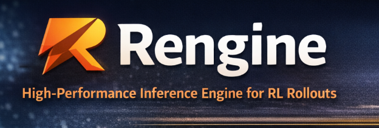

# Rengine

A lightweight minimal inference engine specifically for generating tokens during RL training (RLHF / PPO / DPO), !!


## Benchmark

**Generation throughput (tok/s) — 500M param model, fp16, NVIDIA RTX (5.67GB)**

| Batch | Prompt | Gen | Rengine | HF `generate()` | Speedup |
|-------|--------|-----|---------|-----------------|---------|
| 1     | 32     | 64  | 180.9   | 138.3           | **1.31x** |
| 4     | 32     | 64  | 178.2   | 139.6           | **1.28x** |
| 8     | 32     | 64  | 177.9   | 139.1           | **1.28x** |
| 1     | 32     | 128 | 174.7   | 133.9           | **1.31x** |
| 4     | 32     | 128 | 187.5   | 140.8           | **1.33x** |
| 8     | 32     | 128 | 175.0   | 135.9           | **1.29x** |
| 1     | 128    | 64  | 187.3   | 142.3           | **1.32x** |
| 4     | 128    | 64  | 174.0   | 137.5           | **1.27x** |
| 8     | 128    | 64  | 147.1   | 117.1           | **1.26x** |
| 1     | 128    | 128 | 186.1   | 139.0           | **1.34x** |
| 4     | 128    | 128 | 173.8   | 133.7           | **1.30x** |
| 8     | 128    | 128 | 154.4   | 116.5           | **1.33x** |


**Model specs:**
- Architecture: LLaMA-style decoder-only
- Parameters: ~238M (16 layers, 16 heads, 1024 hidden)
- Vocabulary: 32,000
- Dtype: FP16

**Memory tradeoff:**

| Configuration | Rengine | HF      | Difference |
|---------------|---------|---------|------------|
| batch=1, prompt=32, gen=64  | 1019 MB | 1017 MB | +2 MB  |
| batch=8, prompt=128, gen=128 | 1214 MB | 1150 MB | +64 MB |

Rengine pre-allocates a static KV cache for the full sequence length. Memory usage is comparable to HF's dynamic cache approach.

## Current Optimizations

- Minimal Python logic per decode step (~15 lines in the hot loop)
- Static KV cache — slice writes, no object churn or reallocation
- No attention mask construction during single-token decode
- No logits processor pipeline overhead
- Direct `torch.argmax` / `torch.multinomial` — no abstraction layers
- Flash Attention via PyTorch's SDPA

## Features

- Decoder-only Transformer with RoPE and SwiGLU
- Flash Attention via `F.scaled_dot_product_attention`
- **Custom CUDA kernels for sampling** (greedy, temperature-scaled)
- Static pre-allocated KV cache
- Prefill + autoregressive decoding
- Per-token log-probabilities (RL-ready)
- Temperature, top-k, and nucleus (top-p) sampling
- Weight tying (embedding / lm_head)
- INT8 dynamic quantization


## Usage

```python
from Rengine.inference import InferenceEngine, ModelConfig, Transformer

config = ModelConfig(
    vocab_size=32000,
    num_layers=6,
    num_heads=8,
    hidden_dim=512,
    intermediate_dim=1376,
)

model = Transformer(config).cuda().half()
engine = InferenceEngine(model, device=torch.device("cuda"))

tokens, logprobs = engine.generate(
    prompt_tokens,       # [batch, prompt_len]
    max_new_tokens=128,
    temperature=0.0,     # greedy
)
# tokens:   [batch, num_generated]
# logprobs: [batch, num_generated]  <-- feed directly into PPO loss
```
## Comparison

| | Rengine | HF `generate()` |
|---|---|---|
| RL-focused (logprobs) | Yes | Partial |
| Dynamic KV cache | No | Yes |
| Flash Attention / SDPA | Yes | Yes |
| RoPE | Yes | Yes |
| Weight tying | Yes | Yes |
| Continuous batching | No | Yes |
| Attention mask (padding) | No | Yes |
| Beam search | No | Yes |
| Speculative decoding | No | Yes |


## Requirements

- Python >= 3.10
- PyTorch >= 2.4
- `transformers` (for benchmarking comparison)

```bash
pip install -e ".[dev]"
```

## Tests

```bash
pytest tests/ -v
```

## Roadmap

**Planned:** larger-model benchmarks (200M+), KV-cache memory optimization, reward-model inference path, PPO/TRL integration examples.

**Not planned:** distributed serving, beam search, speculative decoding.

## Status

Experimental, research-grade inference engine. APIs may change. Designed for learning, benchmarking, and RL experimentation.

## License

MIT
